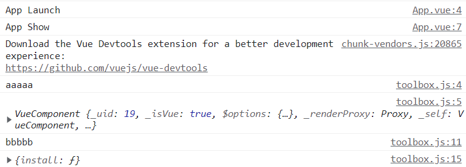

## `Vue` 全局注册方式[^zhaoyang]

```javascript
import Utils from "@/common/utils/index";
export default {
  install: function (Vue) {
    Vue.prototype.$utils = new Utils();
  },
};
```

##### 工具类

```javascript
import uploadFile from "@/request/upload";
/**
 * @exports
 * 全局工具类
 */
export default class Utils {
  constructor() {
    console.log("global utils class");
  }
  /**
   * 显示消息提示框
   * @param { String } title 提示的内容，长度与 icon 取值有关。
   * @param { String } position 纯文本轻提示显示位置
   * @param { String } icon 图标，有效值详见uniapp官方说明。
   * @param { Number } duration 提示的延迟时间，单位毫秒，默认：1500
   * @param { Boolean } mask 防止触摸穿透
   * @example this.$utils.toast(title);
   */
  toast(
    title,
    position = "bottom",
    icon = "none",
    duration = 1500,
    mask = false
  ) {
    uni.showToast({
      title,
      position,
      icon,
      duration,
      mask,
    });
  }
  /**
   * 显示 loading 提示框, 需主动调用
   * @param { String } title 提示的文字内容，显示在loading的下方
   * @param { Boolean } mask 是否显示透明蒙层，防止触摸穿透默认 true
   * @example this.$utils.loading();
   */
  loading(title = "正在加载...", mask = true) {
    uni.showLoading({
      title,
      mask,
    });
  }
  /**
   * 拨打电话
   * @param { String } phoneNumber 目标号码
   * @example this.$utils.makePhone(13311112222);
   */
  makePhone(phoneNumber) {
    uni.makePhoneCall({
      phoneNumber,
    });
  }
  /**
   * 从底部向上弹出操作菜单
   * @param { Array } itemList 按钮的文字数组
   * @param { Function } callback 回调选择按钮的索引
   * @param { String } textColor 按钮的文字颜色
   * @example this.$utils.showActionSheet(['A','B','C'],index => console.log(index));
   */
  showActionSheet(itemList = [], callback, textColor = "#4F4F4F") {
    uni.showActionSheet({
      itemList,
      textColor,
      success: function (res) {
        callback(res.tapIndex);
      },
      fail: function (res) {
        console.error(res.errMsg);
      },
    });
  }
  /**
   * 根据网络状态提示信息
   * @example this.$utils.toastMsgByNetwork();
   */
  toastMsgByNetwork() {
    uni.getNetworkType({
      success(res) {
        switch (res.networkType) {
          case "wifi":
            this.toast("请求超时,可切换为4g试试哦~");
            break;
          case "4g":
            this.toast("当前网络状态不佳,请稍后再试.");
            break;
          case "3g":
            this.toast("当前处在3g状态,可切换为4g后再试试哦~");
            break;
          case "2g":
            this.toast("当前处在2g状态,可切换为4g后再试试哦~");
            break;
          case "ethernet":
            this.toast("当前处在有线网络状态,可切换为4g后再试试哦~");
            break;
          case "unknown":
            this.toast("当前处在不知名网络状态,可切换为4g后再试试哦~");
            break;
          case "none":
            this.toast("网络走丢了哦~");
            break;
          default:
            this.toast("接口请求超时间");
            break;
        }
      },
      fail(err) {
        this.toast("获取网络状态失败");
      },
    });
  }
  /**
   * upx2px
   * @example $utils.upx2px(20) => ≈ 10
   * @description 计算rpx转px
   */
  upx2px(num) {
    return uni.upx2px(num);
  }
  /**
   * 设置剪切板内容
   * @param {*} text
   */
  copy(text) {
    uni.setClipboardData({
      data: text,
      success: () => {
        uni.hideToast();
        this.toast("复制成功", "center");
      },
      fail: () => {
        this.toast("复制失败", "center");
        console.log(err);
      },
    });
  }
  /**
   * 封装图片上传
   * @param { Array } sourceType 是否使用相机
   * @param { Number } maxSize 当前图片的最大占用内存
   * @param { Function } callback 回调当前图片的本地路径
   * @returns { Promise }
   * @example this.$utils.chooseImage(['camera'],1,target => {});
   */
  chooseImage = (
    sourceType = ["camera", "album"],
    maxSize = 1,
    callback = null
  ) => {
    return new Promise((reslove) =>
      uni.chooseImage({
        count: 1,
        sourceType: sourceType,
        sizeType: ["original"],
        success: (chooseImageRes) => {
          const tempFilePaths = chooseImageRes.tempFilePaths;
          callback != null && callback(tempFilePaths[0]);
          /**
           * 压缩文件
           * @param { String } imgData.target 压缩文件路径
           * @param { Number } zipScale 压缩比例
           **/
          const zipImage = (imgData, zipScale) => {
            const uploadNowImage = (imgDataNow) => {
              uploadFile(`url`, imgDataNow.target)
                .then((data) => reslove(data))
                .catch((err) => console.log(err));
            };
            zipScale == null && uploadNowImage(imgData);
            const dstSrc =
              uni.getSystemInfoSync().platform === "android"
                ? `_doc://${new Date().getTime()}.jpg`
                : `file://${new Date().getTime()}.jpg`;
            zipScale &&
              plus.zip.compressImage(
                {
                  src: imgData.target,
                  dst: dstSrc,
                  quality: zipScale,
                },
                (res) => uploadNowImage(res),
                (error) => this.toast("图片压缩失败")
              );
          };
          const { size } = chooseImageRes.tempFiles[0];
          const nowSize = parseFloat(size / 1024 / 1024).toFixed(2);
          if (nowSize <= maxSize) {
            zipImage({ target: tempFilePaths[0], size: size });
          } else {
            const prevZipSize = parseFloat(maxSize / nowSize).toFixed(2) * 100;
            const zipSize = prevZipSize > 10 ? prevZipSize - 10 : prevZipSize;
            zipImage({ target: tempFilePaths[0], size: size }, zipSize);
          }
        },
        fail: (errData) => this.toast(errData),
      })
    );
  };
}
```

##### 上传图片

```javascript
// 导入工具类 并实例化
import Utils from "@/common/utils/index";
const utils = new Utils();

/**
 * @exports
 * 封装上传
 * @param { String } url 上传接口地址
 * @param { String } filePath 本地图片地址
 * @returns { Promise }
 */
export default function (url, filePath, otherData = {}) {
  return new Promise((reslove, reject) => {
    utils.loading("正在上传...");
    uni.uploadFile({
      url: url,
      filePath: filePath,
      header: {},
      formData: otherData,
      name: "file",
      success: ({ statusCode, data }) => {
        const { code, result, message } = JSON.parse(data);
        if (statusCode === 200) {
          if (code === 200) {
            reslove({ result: result, filePath: filePath });
          } else {
            utils.toast(message);
            reject(null);
          }
        } else {
          utils.toast("网络错误");
          reject(null);
        }
      },
      complete: (_) => uni.hideLoading(),
      fail: ({ errMsg }) => {
        if (errMsg === "request:fail timeout") {
          uni.getNetworkType({
            success({ networkType }) {
              networkType === "wifi" &&
                utils.toast("上传失败，请检查您的网络或者切换到4G网络重试");
              networkType === "4g" && utils.toast("上传失败，请重试.");
              networkType !== "4g" &&
                networkType !== "wifi" &&
                utils.toast("上传失败，请切换到4G网络重试");
              reject(null);
            },
            fail: (err) => {
              utils.toast("获取网络状态失败.");
              reject(err);
            },
          });
        } else {
          utils.toast("请求失败.");
          reject(null);
        }
      },
    });
  });
}
```

## 三步实现一个`Vue`工具类[^caojia]

实现方法：全局注册，多文件调用

```js
export default {
  install(Vue) {
    Vue.prototype.$toolFunction = function () {
      //全局注册toolFunction方法
      console.log("11111");
    };
  },
};
```

使用方法：

1. 新建一个`js`文件，用来注册全局方法（此例中新建`toolbox.js`

```js
export default {
  install(Vue, options) {
    (Vue.prototype.$aaaaa = function () {
      //全局注册aaaaa方法
      console.log("aaaaa");
      console.log(this); // this 指向了 Vue 对象
      this.$bbbbb();
      this.$ccccc();
    }),
      (Vue.prototype.$bbbbb = function () {
        //全局注册bbbbb方法
        console.log("bbbbb");
      });

    Vue.prototype.$ccccc = () => {
      console.log(this); // ！不能使用箭頭函數！！！！
    };
  },
};
```

（2）在 main.js 中注入 global.js 文件

```js
import toolbox from "@/utils/toolbox.js";
Vue.use(toolbox);
```

（3）使用：在任意组件中调用`global.js`中的方法：

```js
this.aaaaa();
```

运行结果：



2.定义单独的方法，调用时需引入
代码如下（示例）：

```js
// singleTool.js
export function XXXX(value) {
  console.log("1111");
}
// import {XXXX} from singleTool.js
```

[^zhaoyang]: <https://www.jianshu.com/p/11fdd2a9cf7e>
[^caojia]: https://blog.csdn.net/u013437812/article/details/117816607
