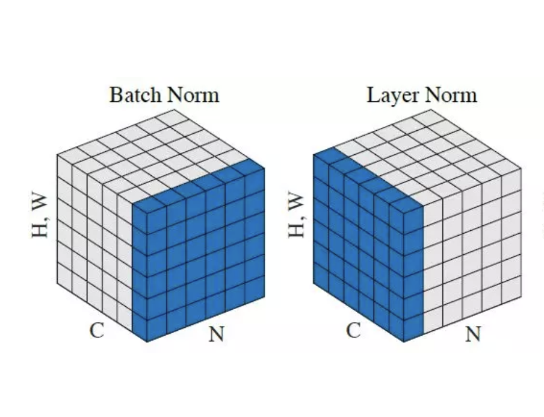

# 起底 MLP

https://pytorch.org/tutorials/beginner/nn_tutorial.html

https://pytorch.org/tutorials/recipes/recipes/defining_a_neural_network.html

`torchvision.ops.MLP` ~~如果你去看它的实现你会发现它就是一堆 `Linear` `BatchNorm` 和 `Dropout`。~~

`torch` Tensor 格式默认为 $(N, C, H, W)$

- `in_channels: int`– 输入的通道数。
- `hidden_channels: List[int]` – List of the hidden channel dimensions
- `norm_layer?: Callable[.., torch.nn.Module]` – 卷积层后的 Norm 层。 Default: `None`
- `activation_layer?: Callable[.., torch.nn.Module]` Norm 层或的激活函数层，默认值`torch.nn.ReLU`
- `inplace: bool`– 激活函数是否 in-place。Default `True`
- `bias: bool` – 线性层是否使用 `bias` Default `True`
- `dropout: float` - Dropout 层概率。 Default: 0.0

看一下封装在下边的都有什么

## 线性层

`torch.nn.Linear(in_features, out_features, bias=True, device=None, dtype=None)`

- **in_features** – size of each input sample
- **out_features** – size of each output sample
- **bias** – If set to `False`, the layer will not learn an additive bias. Default: `True`

会形成一个 $in \times out$ 的矩阵 $W$ 和一个 $out \times 1$ 的矩阵 `b`。

## Normalization

`BatchNorm2d`

$$
y=\frac{x-\mathrm{E}[x]}{\sqrt{\operatorname{Var}[x]+\epsilon}} * \gamma+\beta
$$

- **num_features** – $(N, C, H, W)$ 中的 $C$。
- **eps** – $\epsilon$. Default: `1e-5`
- **momentum** – the value used for the **running_mean** and **running_var** computation. Can be set to `None` for cumulative moving average (i.e. simple average). Default: `0.1`
- **affine** – a boolean value that when set to `True`, this module has **learnable affine parameters**. When `affine=False` the output of `BatchNorm` is equivalent to considering `gamma=1` and `beta=0` as constants. Default: `True`
- **track_running_stats** – a boolean value that when set to `True`, this module tracks the running mean and variance, and when set to `False`, this module does not track such statistics, and initializes statistics buffers `running_mean` and `running_var` as `None`. **When these buffers are `None`, this module always uses batch statistics.** in both training and eval modes. Default: `True`。`track_running_stats=True` 表示跟踪整个训练过程中的 batch 的统计特性，通过线性平滑法获得方差和均值，而不只是仅仅依赖与当前输入的 batch 的统计特性。相反的，如果 `track_running_stats=False` 那么就只是计算当前输入的 batch 的统计特性中的均值和方差了。当在推理阶段的时候，如果 `track_running_stats=False`，此时如果 `batch_size` 比较小，那么其统计特性就会和全局统计特性有着较大偏差，可能导致糟糕的效果。

This **`momentum`** argument is different from one used in **optimizer** classes and the conventional notion of momentum. Mathematically, the update rule for running statistics here is

$$
\hat{x}_{\text {new }}=(1-\text{momentum}) \times \hat{x} +  \text{momentum} \times x_{t}
$$

where $\hat{x}$ is the **estimated statistic** and $x_{t}$ is the **new observed value**. 也就是说，BN 层中的`running_mean` 和 `running_var` 的更新是在 `forward() ` 操作中进行的，而不是 `optimizer.step()` 中进行的，因此如果处于 `training` 状态，就算你不进行手动 `step()`，BN 的统计特性也会变化。[^loseinvain]

模型的 `training` 和 `track_running_stats` 属性的组合关系如下：

1. `training=True, track_running_stats=True`。这个是期望中的训练阶段的设置，此时 BN 将会跟踪整个训练过程中 batch 的统计特性，并使用线性平滑法更新。
2. `training=True, track_running_stats=False`。此时 BN 只会计算**当前**输入的训练 batch 的统计特性，可能没法很好地描述全局的数据统计特性。
3. `training=False, track_running_stats=True`。这个是期望中的测试阶段的设置，此时 BN 会用**训练好**的模型中的`running_mean` 和 `running_var` 并且**不会对其进行更新**。一般来说，只需要设置 `model.eval()` 其中 `model` 中含有 BN 层，即可实现这个功能。
4. `trainng=False, track_running_stats=False` 效果同 (2)，只不过是位于 `eval` 状态，训练中不会这样做，这个只是用测试输入的 batch 的统计特性，容易造成统计特性的偏移，导致糟糕效果。

`BatchNorm` 在 [Batch Normalization: Accelerating Deep Network Training by Reducing Internal Covariate Shift](http://proceedings.mlr.press/v37/ioffe15.pdf) 中被引入。论文由 [Covariance Shift](https://www.sciencedirect.com/science/article/pii/S0378375800001154) 介绍了 **Internal Covariate Shift**

> We refer to the change in the distributions of internal nodes of a deep network, in the course of training, as Internal Covariate Shift. Eliminating it offers a promise of faster training. We propose a new mechanism, which we call Batch Normalization, that takes a step towards reducing internal covariate shift, and in doing so dramatically accelerates the training of deep neural nets. It accomplishes this via a normalization step that fixes the means and variances of layer inputs.

> We define Internal Covariate Shift as the change in the distribution of network activations due to the change in network parameters during training.
>
> 

## Dropout

`Dropout`

- **p** – probability of an element to be zeroed. Default: `0.5`
- **inplace** – If set to `True`, will do this operation in-place. Default: `False`

## 激活函数层

`ReLU`

$$
\operatorname{ReLU}(x)=(x)^{+}=\max (0, x)
$$

**inplace** – can optionally do the operation in-place. Default: `False`

[^loseinvain]: https://blog.csdn.net/LoseInVain/article/details/86476010
