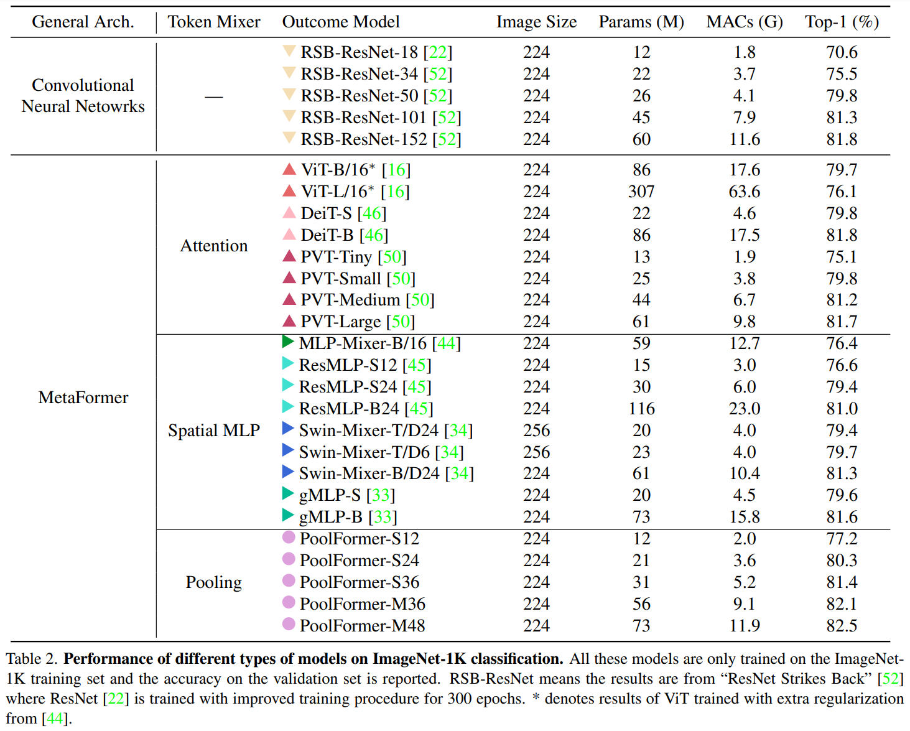
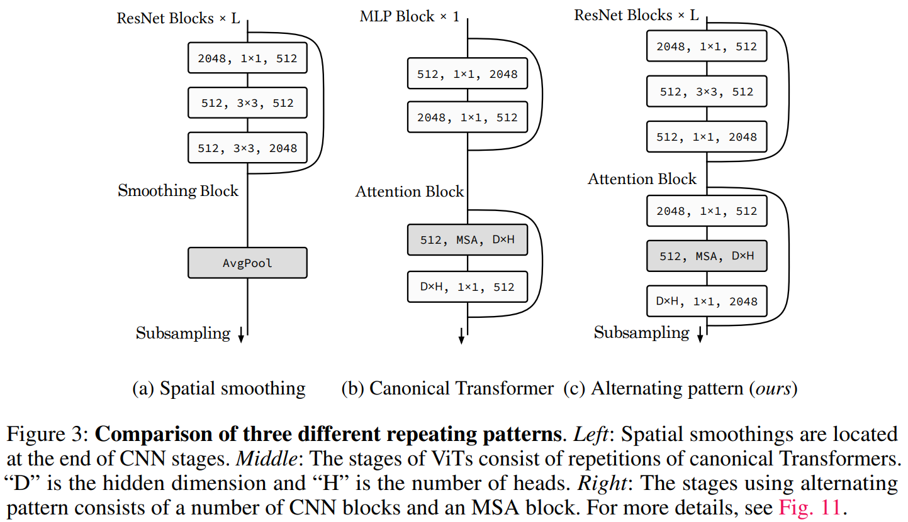

众所周知，Transformer 在视觉领域表现出了很大的潜力，吸引众多研究者对其原理进行探索。今天我为大家带来的是两个探索，一篇是 PoolFormer，一篇是 How do ViTs work.

## Is MetaFormer Actually What You Need for Vision?

~~又是一个标题党~~

MetaFormer 论文对提出了一个全新的概念：MetaFormer。

长期以来，人们对 Transformer 的能力有诸多猜想，比如猜测其学习能力来源于其基于 attention 的 token-mixer 等。但最近 Weihao Yu 等人把 transformer 块换成 MLP，模型的表现依然很好。所以作者假设，是 Transformer 整体架构，而不是一个 token-mixer 或者其他什么。


但是这篇论文并没有说除了自己的实验之外的东西，并且，论文中的对比并不是很合理，显然是拿着比自己差的模型比的，如果去 PapersWithCode 上查，这个模型顶多排到 150 名左右，效果只比 ResNet 好一点。



大家再看看，这个所谓 MetaFormer 的结构是否有些似曾相识。ResNet。对比一下它们的 block 呢？多了中间的 Patch Embedding 层。可能很多人看到这个结果都会很灰心丧气：我们绕了这个大个圈子，最后回到了 ResNet？这些都是没有被理解的问题。

**如果对这些问题视而不见的话**，无异于指鹿为马，拿来一个 ResNet 模型，不光说它是 Transformer，还说它是 Transformer 里表现最好的。这不是扯吗。

所以，面对这篇文章的结果，我们要问的不是 What have we gain，而是 What have we lose。我们在将 MSA 换成 Pool 的时候，**我们丢掉了什么**，又得到了什么？这才是我们关心的。

```python
# https://github.com/sail-sg/poolformer/blob/b5db3fa37b0c6bb6788e1d084d2bddeb4110f224/models/poolformer.py#L401
class PoolFormer(nn.Module):
    def forward(self, x):
        # input embedding
        x = self.forward_embeddings(x)
        # through backbone
        x = self.forward_tokens(x)
        if self.fork_feat:
            # output features of four stages for dense prediction
            return x
        x = self.norm(x)
        cls_out = self.head(x.mean([-2, -1]))
        # for image classification
        return cls_out
```

就是说，我们做的研究已经很多了，是时候对其工作原理进行解释了。

## How do Vision Transformers Work?


